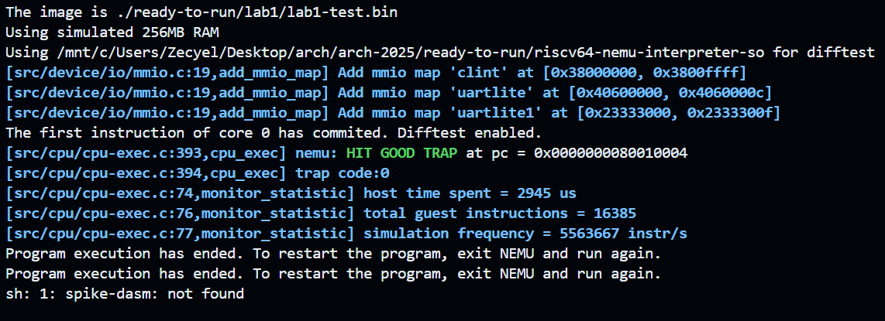
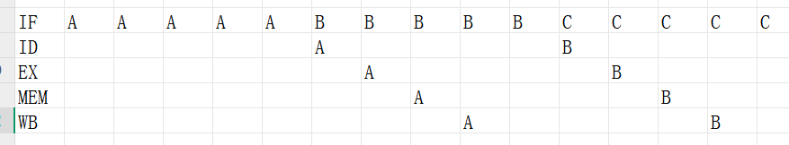
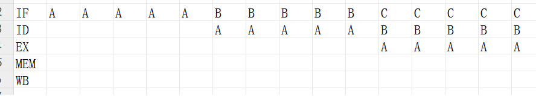

# Arch2025 RISC-V Lab1


| Title      | Student Name    | Student ID  | Date     |
| ---------- | --------------- | ----------- | -------- |
| Arithmetic | Zecyel (朱程炀) | 23300240014 | 2025.3.3 |


## 1. 实验要求&运行结果

实现一个支持 addi, xori, ori, andi, add, sub, and, or, xor, addiw, addw, subw 指令的五级流水线 CPU。



## 2. 代码实现

在 `include/common.sv` L243-245 里定义了一些有趣的东西。

```systemverilog
typedef logic bool;     // i like it
typedef u5 reg_addr;    // i like it too
typedef u32 inst_t;     // i like it three
```

另外还有模块间临时数据存储的结构体定义在 `include/temp_storage.sv`，在 `include/instruction.sv` 里定义了 `ALU` 的一些计算信号。

### 2.1 流水线设计

编写了一个错误的 RISC-V 五级流水线，如下图。



实现的原理是使用了四个中间数据存储结构体，每当获得 clk 信号时，将数据向后推送一个模块。

```systemverilog
fetch fetch_instance (...);
decoder decoder_instance (...);
execute execute_instance (...);
memory memory_instance (...);
writeback writeback_instance (...);

always_ff @(posedge clk or posedge rst) begin
	if (rst) begin
		// drink a cup of java ( also try brew! )
		// take on springboot
		// don't forget your redhat
	end else begin
		if_id_state <= if_id_state_new;
		id_ex_state <= id_ex_state_new;
		ex_mem_state <= ex_mem_state_new;
		mem_wb_state <= mem_wb_state_new;
	end
end
```

>  正确的流水线实现方式应该是，让每个模块都实现一个 is_ok 信号，当五个模块都准备好了，再给它们一起发时钟/使能信号。这样可以让流水线同步运行。正确的流水线如下图所示。
>
>  

忙于实验室的工作，正确的流水线在 lab2 再改（现在又不是不能跑）。

### 2.2 Fetch 模块设计

使用了一个 waiting 来记录当前是否在等待指令总线。使用了伪代码来表示整个模块的工作流程（绝对不是因为我代码写太烂了）。

```systemverilog
bool waiting;

always_ff @(posedge clk or posedge rst) begin
    if (rst)
        // clear the state. reset waiting to 0
    else if (! waiting)
        // send the request
    else if (iresp.addr_ok && iresp.data_ok)
        // send out the instruction
    else
        inst_signal <= 0; // the instruction is invalid!
end
```

### 2.3 其余模块设计

译码、执行和写回都只需要照着架构图编写即可，没有什么困难。下面记录一下踩的几个坑。

#### 2.3.1 手动 reset

不知道为什么，程序计数器（PC）的值没有办法通过 `always_ff @(posedge rst)` 的方法正常初始化，于是手动在程序的最开始重置了整个 CPU 的状态。

```systemverilog
logic manual_reset_signal;
bool reseted;

always_ff @(posedge reset or posedge clk) begin
	if (reset) begin
		reseted <= 0;
		manual_reset_signal <= 0;
	end else begin
		if (reseted) begin
			manual_reset_signal <= 0;
		end else begin
			manual_reset_signal <= 1;
			reseted <= 1;
		end
	end
end
```

之后在程序中使用 manual_reset_signal 即可。

#### 2.3.2 延迟提交

原来的代码里，写回和提交 Difftest 是在同时进行的，导致寄存器还没写就已经提交了。于是需要手动将 commit 信号延迟一个周期。

```systemverilog
bool raw_valid_signal;
bool delayed_1_clock_valid_signal;

writeback writeback_instance (
	.valid(raw_valid_signal),
    // other parameters
);

always_ff @(posedge clk) begin
    delayed_1_clock_valid_signal <= raw_valid_signal;
end

assign valid = delayed_1_clock_valid_signal;
```

## 3. 实验心得

助教们都很帅！很负责！很厉害！要是能给我的实验报告打高分就更帅了！
