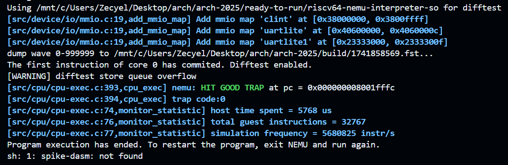

# Arch2025 RISC-V Lab2


| Title      | Student Name    | Student ID  | Date     |
| ---------- | --------------- | ----------- | -------- |
| Memory Access | Zecyel (朱程炀) | 23300240014 | 2025.3.13 |


## 1. 实验要求&运行结果

实现一个支持 ld, sd, lb, lh, lw, lbu, lhu, lwu, sb, sh, sw, lui 指令的五级流水线 CPU。

注意：lab2 中，内存访问延迟的周期数将会变为随机值，你需要根据 `data_ok` 信号来判断指令/数据访存请求是否完成。



## 2. 代码实现

### 2.1 修复 Lab1 中的历史遗留问题

Lab1 的代码写的实在是太烂了，于是在写 Lab2 直接进行了大重构，主要集中在以下几点。

* 调整了 commit 的时机。
* 让五个模块同步工作，实现正确的五级流水线。
* 剥离寄存器组。
* 编写了正确的转发逻辑。
* 完善了译码器，使用枚举类型来标识指令。

下面就这四点来分点对代码的修改进行叙述。

#### 2.1.1 commit 阶段

在五级流水线之后，添加了一个 commit 阶段。于是相应的，多了一个叫做 `wb_commit_state` 的寄存器，用来保存需要提交的部分信息。修改过后，就无需手动将 commit 的 `valid` 信号手动延后一个周期，代码变好看了！

#### 2.1.2 正确的五级流水线实现

让五个模块都返回了一个 `ok` 信号，将其汇总之后得到 `unified_ok`。

```systemverilog
bool fetch_ok, decoder_ok, execute_ok, memory_ok, writeback_ok;
bool unified_ok;

assign unified_ok = fetch_ok & decoder_ok & execute_ok & memory_ok & writeback_ok;
```

之后，让需要同步的模块（这里是 fetch 和 memory）获取 `unified_ok` 信号，并让其在被允许执行时才执行，例如将 fetch 模块改成了如下所示。`enable` 即为 `unified_ok`，使用 `enable` 更符合对于 fetch 模块封装之后的语义。

```systemverilog
always_ff @(posedge rst or posedge clk) begin
    if (rst) begin
        _pc <= PCINIT;
    end else if (! waiting & enable) begin
        _pc <= _pc + 4;
    end
end
```

#### 2.1.3 寄存器组的分离

将寄存器组进行了读写分离。`reg` 模块仅处理“写”操作，同时将所有寄存器的值使用组合逻辑返回出去。

#### 2.1.4 转发逻辑的实现

首先先对“写寄存器”行为进行封装。

```systemverilog
typedef struct packed {
    reg_addr reg_dest_addr;
    bool reg_write_enable;
    word_t reg_write_data;
} reg_writer;
```

之后需要确定转发路径。一般来说只需要两条转发路径，ex_id 与 mem_id，但是由于“读”寄存器操作会读取到“写”操作之前的值，所以在这个例子中还需要 wb_id 这条转发路径。如果学习 Boreas 老师的写法，读寄存器前先判断这个寄存器是不是正在被写入的，那么就不需要 wb_id 这条转发路径了。

之后在 decoder.sv 中如下编写即可。forward1、forward2、forward3 的优先级依次降低。

```systemverilog
id_ex_state.reg1_value =
	forward1.reg_write_enable &&
	forward1.reg_dest_addr != 0 &&
	forward1.reg_dest_addr == inst[19:15]
? forward1.reg_write_data :
    forward2.reg_write_enable &&
	forward2.reg_dest_addr != 0 &&
	forward2.reg_dest_addr == inst[19:15]
? forward2.reg_write_data :
    forward3.reg_write_enable &&
	forward3.reg_dest_addr != 0 &&
	forward3.reg_dest_addr == inst[19:15]
? forward3.reg_write_data
: regs_value[inst[19:15]];
```

#### 2.1.5 完善译码器

首先对 cpu 支持的所有指令定义了一个枚举类型。

```systemverilog
typedef enum { 
    ADD, SUB, XOR, OR, AND,
    SLL, SRL, SRA, SLT, SLTU, // not implemented
    ADDI, XORI, ORI, ANDI,
    SLLI, SRLI, SRAI, SLTI, SLTIU, // not implemented
    // ...
    ECALL, EBREAK // not implemented (including decoder)
} instruction_type;
```

之后提取出 `parse_instruction` 模块，将读取 `opcode`、`funct3`、`funct7` 等脏活全部塞到这里面。

同时还实现了一些常用函数，比如 `parse_immed`，`is_arith`，`is_write_reg`，`is_memory` 等。

### 2.2 实现访存功能

#### 2.2.1 内存对齐

首先，出于对内存对齐的需要，实现了内存对齐相关的一系列函数。然后我们假定每条指令的执行都不需要二次访存。例如，当我需要获取从 `0x1145140001` 开始的 8 个字节，出于内存对齐的要求，需要先获取从 `0x1145140000` 开始的 8 个字节，再获取 `0x1145140008` 这一字节。通过仔细阅读测试用的汇编语言，不难计算到测试用例中并没有这样的需求。

基于此，我实现了 `read_align` 和 `write_align` 两个函数，前者用来将从内存中读出的数据还原出指令本身希望读取的数据，后者用来将指令希望写的数据进行对齐后再发起写内存请求。这两个函数都是一个 unique case 即可解决的问题，以 `read_align` 为例。

```systemverilog
module read_align
    import common::*;
(
    input addr_t addr,
    input word_t data,
    input msize_t size,
    input bool zero_extend,
    output word_t raw_data
);
    word_t unextended_data;
    always_comb begin
        case (size)
            MSIZE1: begin
                unextended_data[7:0] = data[8*addr[2:0] +: 8];
                raw_data = zero_extend
                    ? { 56'b0, unextended_data[7:0] }
                    : { {56{unextended_data[7]}}, unextended_data[7:0] };
            end
			// ... as the same ...
        endcase
    end
endmodule
```

#### 2.2.2 驱动内存总线

大体上参照 fetch 模块编写即可，但是会遇到奇怪的问题：在发送内存请求并得到应答之后，mem 模块会在下一个上升沿执行完毕，但是由于 enable 信号在这个上升沿结束之后，才能因为获取到下一条指令而更新。因此，在学习了 tmysam 的设计思路后，使用了一个 `cur_mem_op_started` 的标记来标记是否已经进行了此次访存，并在访存结束后将其恢复。

```systemverilog
always_ff @(posedge clk or posedge rst) begin
    if (rst) begin
        waiting <= 0;
        dreq.valid <= 0;
    end else begin
        if (unified_ok) begin
            cur_mem_op_started <= 0;
        end
        if (! waiting & enable & ! cur_mem_op_started) begin
            waiting <= 1;
            cur_mem_op_started <= 1;
            // make the databus request
        end else if (dresp.addr_ok & dresp.data_ok & cur_mem_op_started) begin
            readout_data <= dresp.data;
            waiting <= 0;
            dreq.valid <= 0;
        end
    end
end
```

#### 2.2.3 新增加的转发

我们注意到，如果遇到了类似 `ld x1, (x2); add x1, x1, x1;` 的指令，由于前一条指令在 mem 阶段才获取到结果，然而第二条指令此时已经进入了 ex 阶段。于是我们需要在之前的三条转发的基础上，再添加 mem_ex 和 wb_ex 的两条转发。

### 2.3 彩蛋

* 程序末尾的 `deadbeef` 是一个合法的 riscv 指令，在本例中被用来当作数据段。
* msize_t 是一个 i3 类型的枚举类型，虽然枚举类型的可能情况只有 4 个。因此会到处触发一些“latch”“case 未覆盖所有情况”等错误。不过没关系，我已经在程序的各个地方都塞满了奇怪的 dummy value。
* 阅读代码寻找更多彩蛋。

## 3. 实验心得

助教们都很帅！很负责！很厉害！要是能给我的实验报告打高分就更帅了！
