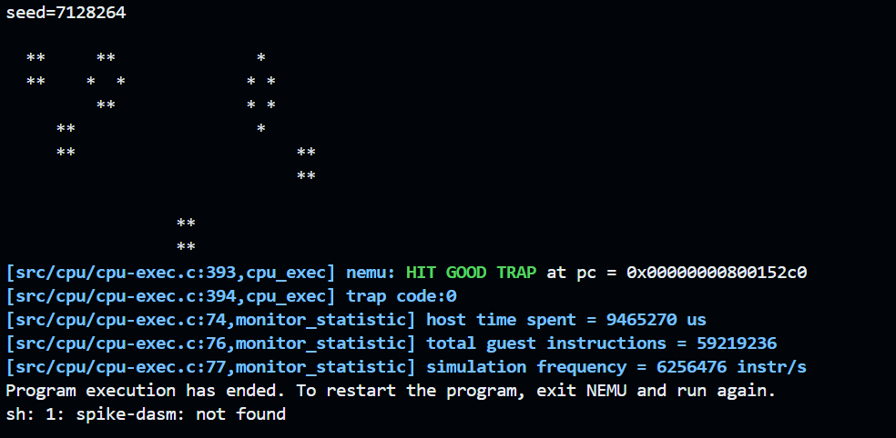

# Arch2025 RISC-V Lab3


| Title      | Student Name    | Student ID  | Date     |
| ---------- | --------------- | ----------- | -------- |
| Jump Instruction | Zecyel (朱程炀) | 23300240014 | 2025.4.3 |


## 1. 实验要求&运行结果

实现一个支持 beq, bne, blt, bge, bltu, bgeu, slti, sltiu, slli, srli, srai, sll, slt, sltu, srl, sra, slliw, srliw, sraiw, sllw, srlw, sraw, auipc, jalr, jal 指令的五级流水线 CPU。




## 2. 代码实现

sxxx，auipc 指令就当作普通计算指令实现即可，没有什么特殊的。为了实现跳转指令，做了下面的两个修改。

### 2.1 阻塞流水线

为了正确处理跳转，防止出现“已经将 bne 的下一条指令送入流水线了但是发现需要跳转”之类的问题，程序会在跳转指令之后塞入 nop 空指令。

### 2.2 指令签名

由于我懒的写一些复杂的逻辑了，然后想出来了这么一个偷懒的方法。当 fetch 单元取到一条指令后，就自增内部的一个计数器，然后携带这指令一起传递下去。实际上这个计数器只需要 3-bits 即可（因为只有五级流水线）。

于是在做了这些操作之后，可以极致地压缩程序的性能。

## 坤. 奇怪的优化

### 坤.1 提前访存

一个读内存的指令，在正常情况下需要这样写：

```systemverilog
always_ff @(posedge clk) begin
    if (is_read_mem_inst) begin
        dreq.valid <= 1;
        ok <= 0;
    end
end
```

但是在此之后就可以这么写：

```systemverilog
u3 inst_id;
assign ok = inst_id == ex_mem.inst_id && ...;
assign dreq.valid = inst_id != ex_mem.inst_id || ...;

always_ff @(posedge clk) begin
    inst_id <= ex_mem.inst_id;
end
```

这样就可以提前一个周期发送取指指令。

### 坤.2 提前 commit

由于某些原因，commit 被我改成了时序的，现在它可以这么写：

```systemverilog
u3 inst_id;
assign ok = inst_id == wb_commit.inst_id;

always_ff @(posedge clk) begin
    inst_id <= wb_commit.inst_id;
end
```

这样其实是和组合逻辑一样快的，而且能确保每个指令只会被提交一次，而且提交信号只有一个宽度为 1 的脉冲。

### 坤.3 更好写的 fetch

需要 stall 的 fetch 指令感觉不好写，但是加了这个特性就好写不少了。

```systemverilog
if (! waiting & enable) begin
    if (! stall || inst_id == stall_inst_id) begin
        stall <= 0;
        // 没阻塞，或者需要阻塞的指令已经执行完了
        // update pc and send next ireq
    end else begin
        // send nop to pipeline
    end
end else if (iresp.addr_ok && iresp.data_ok) begin
    cur_inst_id <= cur_inst_id + 1;
    if (is_need_stall_inst(cur_inst)) begin
        stall <= 1;
        stall_inst_id = cur_inst_id;
    end else stall <= 0;
end
```

同时还为后续可能引发中断的指令预留了空间，只需要给可能引发中断的指令都 stall 就行了。

## 3. 实验心得

助教们都很帅！很负责！很厉害！要是能给我的实验报告打高分就更帅了！