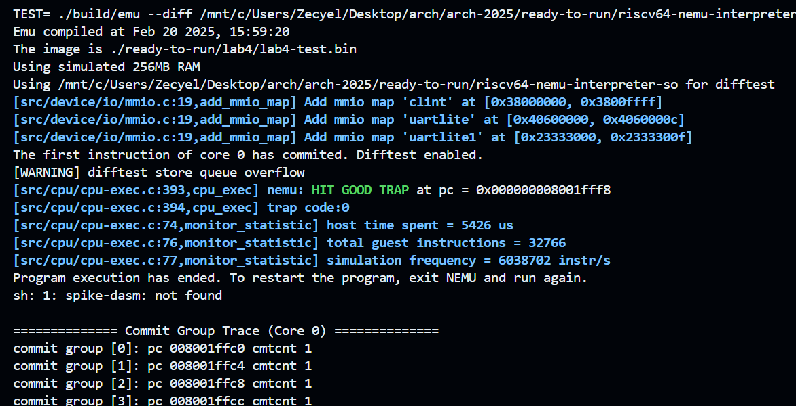
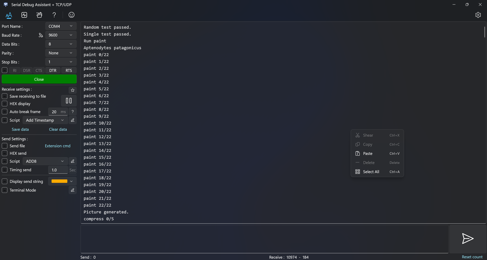
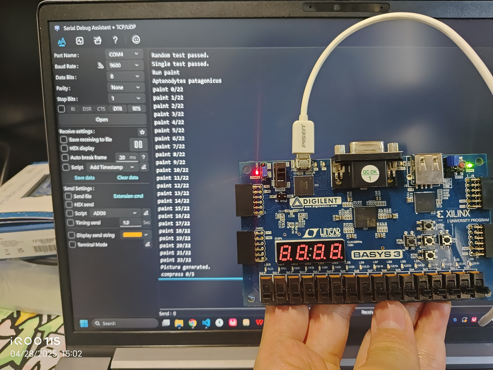
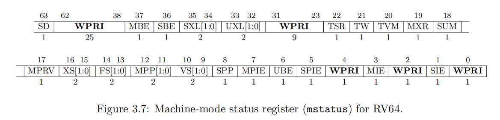
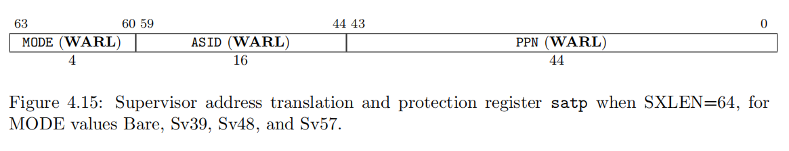

# Arch2025 RISC-V Lab4


| Title         | Student Name    | Student ID  | Date     |
| ------------- | --------------- | ----------- | -------- |
| CSR Registers | Zecyel (朱程炀) | 23300240014 | 2025.4.29 |


## 1. 实验要求&运行结果

1. 实现一个支持 CSRRW, CSRRS, CSRRC, CSRRWI, CSRRSI, CSRRCI 指令和 mstatus, mtvec, mip, mie, mscratch, mcause, mtval, mepc, mcycle, mhartid, satp 寄存器的五级流水线 CPU。

2. 在 Vivado 上进行仿真，并在仿真通过后在 FPGA 板上进行测试。







## 2. 代码实现

就像实现另外的十几个寄存器一样就行了。但是由于这些 CSR 寄存器会在后面的 lab 中被特殊使用，所以就不把它和之前的寄存器混在一起了。

由于需要处理 mcycle 这一个特殊寄存器，所以可以这么写，在mcycle没有被写入的时候，不管是否使能了写 CSR 寄存器的信号，都将 mcycle寄存器自增。

```systemverilog
always_ff @(posedge clk or posedge rst) begin
    if (rst) begin
        csr_reg.mstatus <= 0;
        ...
    end else if (! csr_write_enable)
        csr_reg.mcycle <= csr_reg.mcycle + 1;
    else if (csr_write_enable) begin
        if (csr_dest_addr != CSR_MCYCLE)
            csr_reg.mcycle <= csr_reg.mcycle + 1;
        unique case (csr_dest_addr)
            CSR_MSTATUS: csr_reg.mstatus <= csr_write_data & MSTATUS_MASK;
            ...
        endcase
    end
end
```

有一个槽点在于，CSR 的立即数指令和 I-type 指令不太一样，会把原来五位的寄存器地址用作立即数。

```systemverilog
alu alu_inst (
    .op1(csr_immed ? { 59'b0, id_ex_state.reg1_addr } : op1),
    ...
);
```

刷新流水线的实现：从 lab3 开始，维护了一个“需要阻塞的指令”列表，遇到诸如 jalr，csrrw 等指令，fetch 模块就会一直等待这条指令执行完，避免本不应该执行的指令被加入流水线。

其余逻辑和写普通寄存器一样即可。

## 3. Bonus

### 3.1 CSR 寄存器作用

#### 3.1.1 mstatus



管理 CPU 状态的一个总的寄存器。例如，MIE 是全局的 M 模式中断开关，TVM 是全局的陷阱控制开关。

#### 3.1.2 mtvec

最低两位 MODE 表示陷阱处理模式。剩余 62 位 BASE 是陷阱处理程序的入口地址（4 字节对齐）。

* MODE = 0 时，所有的陷阱都由 BASE 位置的程序处理。
* MODE = 1 时，由 BASE + cause * 4 处的程序处理。

#### 3.1.3 mip / mie

全称是 Machine Interrupt-Pending Register 和 Machine Interrupt-Enable Register。其中 MIE 寄存器是中断使能寄存器，表示当前有哪些中断可以被触发（前提是 mstatus.MIE = 1），包含了软件中断，外部中断和计时器中断，以及系统设置的中断。MIP 寄存器保存了当前有哪些中断已经触发但尚未处理。

#### 3.1.4 mscratch / mepc

两个陷阱临时寄存器。

* mscratch 用于在陷阱处理中保存 sp。
* mepc 用于在陷阱处理中保存 pc。在 mret 的时候就用

#### 3.1.5 mcause

最高位为 1 的时候表示陷阱的原因是中断，为 2 的时候是异常。后面的 63 为记录了陷阱的原因。可以根据表格查出对应的陷阱原因。

#### 3.1.6 mtval

记录异常发生时的相关附加参数。当内存访问异常时，mtval 会保存触发异常的虚拟内存地址。当非法指令异常时，mtval 会保存故障指令。

#### 3.1.7 mcycle

每个 cpu 时钟周期就计数，可以用于性能监测。

#### 3.1.8 mhartid

标识硬件线程（hart）的唯一ID。例如，多核系统中，核 0 的 mhartid = 0，核 1 的 mhartid = 1。

#### 3.1.9 satp

Supervisor Address Translation and Protection Register，用于 S 模式下的虚拟内存转义和保护。



MODE = 0 时表示不启用虚拟地址。MODE = 8~10 时可以设置页的长度。

### 3.2 为什么要在 CSR 指令刷新流水线

首先是，CSR 指令会同时修改 CSR 寄存器和普通寄存器，如何不进行冲刷，会破坏 CSR 指令的原子性，暴露两次拷贝的中间状态。

其次，如果在 CSR 指令执行完之后，发生了中断/异常，之后可能需要跳转到其它地方执行。这时候就应该冲刷掉原本已经被加入流水线的指令。

## 4. 实验心得

助教们都很帅！很负责！很厉害！要是能给我的实验报告打高分就更帅了！
