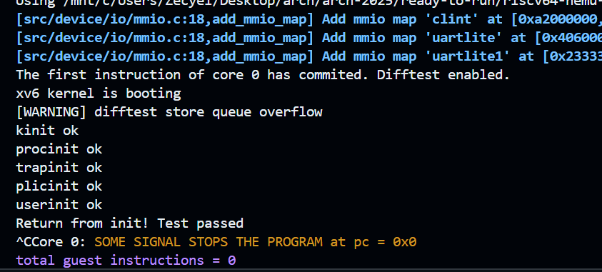
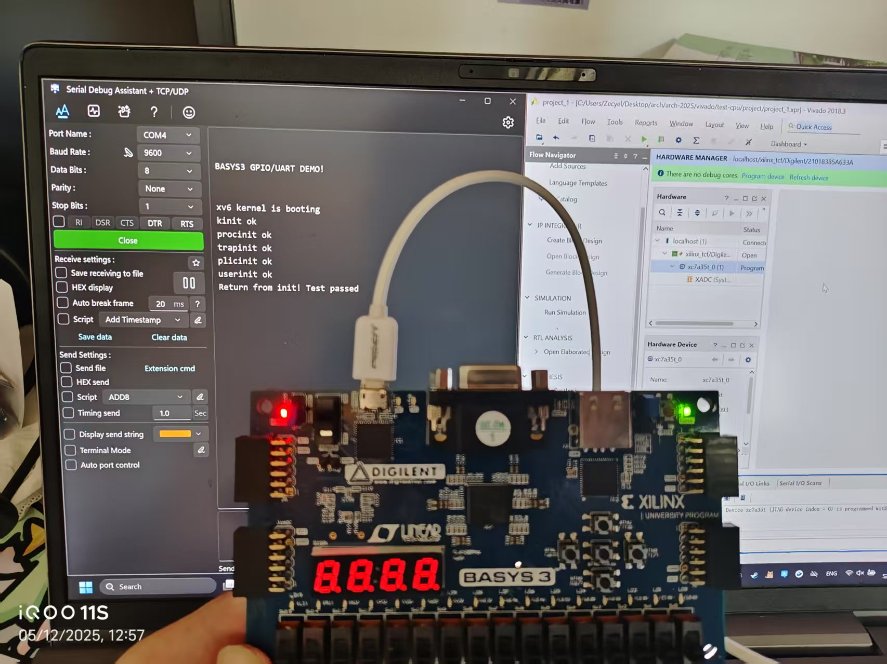
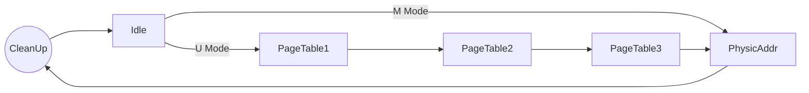

# Arch2025 RISC-V Lab4


| Title         | Student Name    | Student ID  | Date     |
| ------------- | --------------- | ----------- | -------- |
| MMU | Zecyel (朱程炀) | 23300240014 | 2025.5.12 |


## 1. 实验要求&运行结果

1. 实现一个支持 mret 和 ecall 指令的五级流水线 CPU，需要在 U 模式下启用 MMU。
2. 在 Vivado 上进行仿真，并在仿真通过后在 FPGA 板上进行测试。





## 2. 代码实现

### 2.1 特权级切换

由于可能存在需要同时修改多个 csr 寄存器的需求，如果是普通的寄存器组，可以向 regfile 连接几个 writer。但是有些指令会同时修改很多很多个 csr 寄存器。在最开始我尝试将整个寄存器组更新，但是发现这样需要将 88 个字节的数据传来传去，感觉开销太大。最后使用了一个更差的方案：让 csr.sv 处理特权级切换，并且把所有需要用到的东西（比如 pc）之间塞到 csr_writer 里面。

```systemverilog
if (writer.ecall) begin
    csr_reg.mstatus <= {
        csr_reg.mstatus[63:13],
        pmode, // mpp
        csr_reg.mstatus[10:8],
        csr_reg.mstatus[3], // mpie
        csr_reg.mstatus[6:4],
        1'b0, // mie
        csr_reg.mstatus[2:0]
    };
    csr_reg.mepc <= writer.pc;
    csr_reg.mcause <= 8;
    new_pmode <= MACHINE_MODE;
    update_pmode <= 1;
end else if (writer.mret) begin
    csr_reg.mstatus <= {
        csr_reg.mstatus[63:8],
        1'b1, // mpie
        csr_reg.mstatus[6:4],
        csr_reg.mstatus[7], // mie
        csr_reg.mstatus[2:0]
    };
    new_pmode <= USER_MODE;
    update_pmode <= 1;
end
```

其余的工作就只需要在 riscv.sv 里，维护一个 privilege_mode 即可。

### 2.2 MMU

由于 dbus 和 ibus 都需要经过 MMU 转写，但是 ibus 是 32 位的，MMU 则必须是 64 位的，为了避免修改 ibus 的定义，选择了直接在 ibus 和 dbus 都变成了 cbus 之后，在 CbusArbiter 里面添加 MMU 的逻辑。

```systemverilog
cbus_req_t req_virt;
cbus_resp_t resp_virt;
mmu mmu_inst (
    .clk(clk),
    .rst(reset),
    .satp(satp),
    .priviledge_mode(priviledge_mode),
    .req_virt(req_virt),
    .req_phys(oreq),
    .resp_phys(oresp),
    .resp_virt(resp_virt),
    .skip(skip)
);
// 之后将后文原本的 oreq 全部替换成 req_virt，oresp替换成 resp_virt。
```

MMU 这里的作用就是，拦截原本要发送的请求，然后手动修改完了再发送。同时拦截本来的应答，过滤掉中间寻址的过程，然后将最终的应答组装好之后再返回，类似于一个“中间件”。



```systemverilog
case (state)
    CLEANUP: begin // clear the resp of last mmu translate
        state <= IDLE;
        resp_virt.last <= 0;
        resp_virt.ready <= 0;
        resp_virt.data <= 0;
        skip <= 0;
    end
    IDLE: if (req_virt.valid) // the core send a request
        if (priviledge_mode == MACHINE_MODE) begin
            state <= PHY;
            req_phys <= req_virt;
        end else begin
            state <= PT1;
            req_phys.addr <= {8'b0, satp[43:0]/* PPN */, req_virt.addr[38:30], 3'b0};
            req_phys.strobe <= 0; // read
            // other parameters
        end
    PT1: if (resp_phys.last && resp_phys.ready) begin
        state <= PT2;
        req_phys.addr <= {8'b0, resp_phys.data[53:10], req_virt.addr[29:21], 3'b0};
        // other parameters
    end
	// PT2 the same as PT1
    PT3: if (resp_phys.last && resp_phys.ready) begin
        state <= PHY;
        req_phys.addr <= {8'b0, resp_phys.data[53:10], req_virt.addr[11:0]};
        skip <= resp_phys.data[29] == 0; // for the stupid difftest
    end
    PHY: if (resp_phys.last && resp_phys.ready) begin
        state <= CLEANUP; // clear the request
        req_phys.valid <= 0;
        // copy the result to output
        resp_virt.last <= resp_phys.last;
        resp_virt.ready <= resp_phys.ready;
        resp_virt.data <= resp_phys.data;
    end
endcase
```

由于可能会在用户模式下访问外设，在舍友提醒下，这里对 difftest 需要用到的 skip 信号也作出了调整，使用最终翻译出来的物理地址来判断是否需要让 difftest 进行 skip。虽然在最终的测试程序里也没有用到这个的说（

## 3. 实验心得

助教们都很帅！很负责！很厉害！要是能给我的实验报告打高分就更帅了！

感谢爱泽 TV 中的唐泽群友在写 Lab 时给我提供的精神支持和乐子来源。
