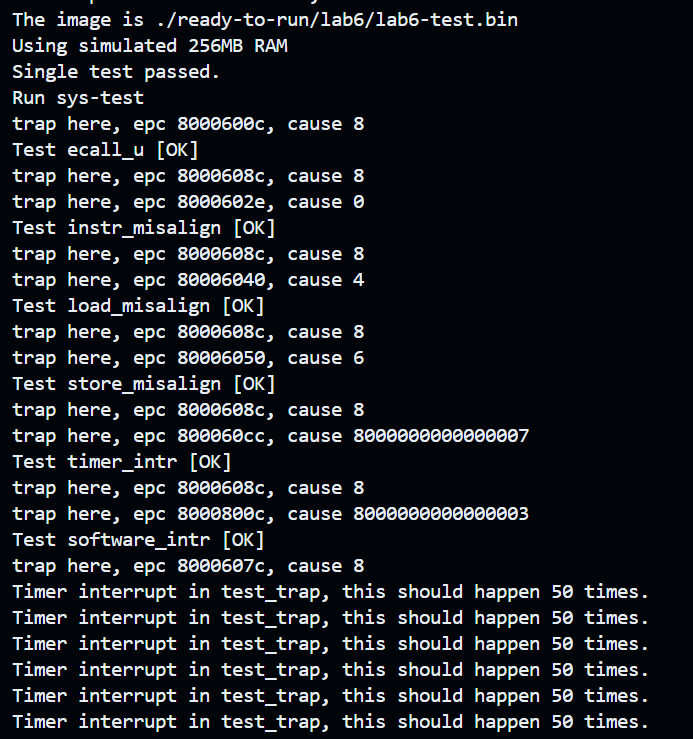
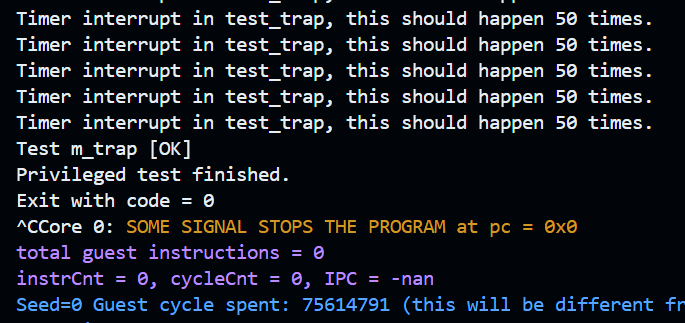

# Arch2025 RISC-V Lab6


| Title         | Student Name    | Student ID  | Date     |
| ------------- | --------------- | ----------- | -------- |
| Exceptions and Interrupts | Zecyel (朱程炀) | 23300240014 | 2025.5.17 |


## 1. 实验要求&运行结果

实现一个支持四种异常（指令不对齐、访存地址不对齐、非法指令、ecall）和三种中断（软件中断、时钟中断、外部中断）的五级流水线 CPU。




## 2. 代码实现

由于我们在 lab5 已经正确地实现了 ecall 的处理逻辑，所以这次 lab 相对简单，只需要仿照 ecall 的处理逻辑，再添加几条相同的处理管线即可。

### 2.1 指令地址不对齐

由于指令地址不对齐只发生在跳转到的地址不对齐，所以只需要检查 jmp 的情况即可。

```systemverilog
if (jump.do_jump == 1 && jump.dest_addr[1:0] != 0) begin
    if_id_state.trap.trap_valid <= 1;
    if_id_state.trap.trap_code <= 0; // pc unaligned
    if_id_state.trap.is_exception <= 1;
    if_id_state.inst <= 0; // send a fake nop
    if_id_state.valid <= 0;
end
```

### 2.2 访存地址不对齐

根据指令的类型，对访存地址进行检查。异常的处理方式和指令地址不对齐类似。

```systemverilog
module align_check
    import common::*;
    import instruction::*;
(
    input instruction_type op,
    input addr_t addr,
    output bool ok
);
    always_comb begin
        case (op)
            LB, LBU, SB: ok = 1;
            LH, LHU, SH: ok = addr[0] == 0;
            LW, LWU, SW: ok = addr[1:0] == 0;
            LD, SD: ok = addr[2:0] == 0;
            default: ok = 0;
        endcase
    end
endmodule
```

### 2.3 非法指令

在原先的程序中，译码器将所有不能识别的程序都当成 NOP，只需将其修改成 ILLEGAL_INST 即可。

```systemverilog
if (op == ILLEGAL_INST) begin
    id_ex_state.trap.trap_valid = 1;
    id_ex_state.trap.trap_code = 2; // illegal instruction
    id_ex_state.trap.is_exception = 1;
end
```

### 2.4 外部中断

中断处理的条件是满足下面之一 (1) 刚收到一个中断信号 (2) 刚执行过 mret (3) mip，mie，mstatus 刚被CSR写入修改过。

在实际的测试用例中，由于有这一段测试：

```assembly
loop:
    addi	s1,s1,-1
    beqz	s1,80008094 <m_test_trap_fail>
    csrsi	mstatus,8
    csrci	mstatus,8
    bgez	s0,8000803c <loop>
```

这段程序反复开关中断使能位，所以其实将（1）和（3）写了比较好。而我实现的 CPU 在每个时钟上升沿都对外部中断进行了检查，能完美涵盖（1）（2）（3）中的要求。下面是 fetch.sv 中的部分代码。

```systemverilog
if ((priviledge_mode == MACHINE_MODE && mstatus[3] == 1 || priviledge_mode == USER_MODE) && (trint && mie[7] == 1 || swint && mie[3] == 1 || exint && mie[11] == 1) && current_int_handling == 0) begin
    if_id_state.trap.trap_valid <= 1;
    if (swint && mie[3] == 1) begin
        if_id_state.trap.trap_code <= 3;
        current_int_handling <= 2;
    end else if (trint && mie[7] == 1) begin
        if_id_state.trap.trap_code <= 7;
        current_int_handling <= 1;
    end else if (exint && mie[11] == 1) begin
        if_id_state.trap.trap_code <= 11;
        current_int_handling <= 3;
    end
end
```

其余部分可以像指令地址不对齐中处理的那样，发送一条假的指令即可。

## 3. 实验心得

助教们都很帅！很负责！很厉害！要是能给我的实验报告打高分就更帅了！

感谢 🍀 在写 Lab 时给我提供的精神支持。
